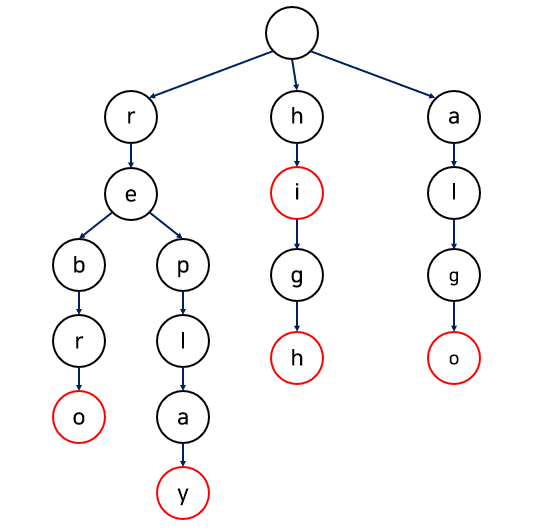

## 다중 조건 정렬
아래는 학번, 이름, 주소순으로 정렬하는 예제
```java
class Student {
    int num;
    String name;
    String address;
    
    Student(int num, String name, String address) {
        this.num = num;
        this.name = name;
        this.address = address;
    }
}


class StudentCompare implements Comparator<Student> {
    int ret = 0;
    
    @Override
    public int compare(Student s1, Student s2) {
        if(s1.num < s2.num) {
            ret = -1;
        }else if(s1.num == s2.num) {
            if(s1.name.compareTo(s2.name) == 0) {
                if(s1.address.compareTo(s2.address) < 0) {
                    ret = 1;
                } else if(s1.address.compareTo(s2.address) == 0) {
                    ret = 0;
                } else if(s1.address.compareTo(s2.address) > 0) {
                    ret = -1;
                }
            } else if(s1.name.compareTo(s2.name) < 0) {
                ret = -1;
            } else if(s1.name.compareTo(s2.name) > 0) {
                ret = 1;
            }
        }else{
            ret = 1;
        }
        return ret;
    }
}
```

## Comparator 람다 활용
- 기본 표현 방식
```java
Collections.sort(books, new Comparator<Book>() {
   @Override
   public int compare(Book o1, Book o2) {
       return o2.getPrice()-o1.getPrice();
  }
});
```

- 람다
```java
Collections.sort(books, (o1, o2) -> o2.getPrice()-o1.getPrice()); 
```

## 이진 탐색
최적화 문제에서 값을 바로 구하기 어려운 경우, ==yes or no==의 문제로 바꾸어 해결할 수 있다.

```
예제. 떡이 n개가 주어지고 원하는 총 떡의 길이 m이 주어진다. 그리고 각 떡의 길이에 해당하는 배열이 주어진다. 이 경우에 떡을 x cm의 절단기로 자를 때 잘라 남겨진 떡의 총 길이가 m보다 크면서 최대가 되는 x값을 구하라. (떡의 개수는 최대 10^9)
```

```cpp
//n:떡의 수, m: 목표
int start =0;
int end = 1e9;
int result = 0;
while(start<=end){
    long long sum = 0;
    int mid = (start+end)/2;
    for(int i=0; i<n; i++){
        if(arr[i]>mid)
            sum=sum+(arr[i]-mid);
    }
    if(sum<m){
        end = mid-1;
    }else{
        result = mid;
        start - mid+1;
    }
        
}
```

## 백 트래킹(Back Tracking)
==모든 경우의 수==를 찾을 때 효율적으로 찾는 알고리즘. Decision Space라는 모든 경우의 수를 따지면서
더 이상 계산이 필요 없는 경우의 수는 제거하는 방법으로 진행된다.

```
예제. 전화기 키패드 문제
"25"라는 숫자를 누른다고 가정할 때 "2"는 "ABC" "5"는 "JKL"이 가능하다. 이 과정에서 가능한 모든 경우의 수를 구하는 문제이다. 보통 재귀를 활용해서 백 트래킹 문제를 해결한다.

답: ["AJ","AK","AL","BJ","BK","BL","CJ","CK","CL"]
```


```
예제. "259"의 경우 가능한 경우의 수 (input=[2,5,9])
```

```python
# index: 현재 가리키는 수, letter: 현재 완성 글자
output = []

def BackTracking(index, letter):
    if index >= len(input):
        ouput.add(letter)
        return

    num = input[index]
    characters = map[num] # map:{ 2:[A,B,C], 5:[J,K,L], ...}
    for(char : characters){
        BackTracking(index+1, letter+char)
    }

def __main__:
    BackTraking(0,"")
```


## Two pointer
투 포인터는 두 개의 포인터를 각각 컨트롤하여 범위를 좁혀가는 알고리즘이다.

```
예제. {2,3,4,2,1,5} 배열이 있을 때, 부분 배열의 합이 5인 경우의 총 개수를 구하라.
```
```java
int[] arr = {2,3,4,2,1,5};
int n = 6;
int target = 5;
int sum = 0;
int count = 0;
int start, end;
for(start=0,end=0; start< n; start++){
    while(sum < target && end < n)
        sum+=arr[end++];
    if(sum==target)
        count++;
        sum-=arr[start];
}
```

## 구간 합
특정 배열이 있을 때, i~j 까지 구간의 인덱스 값들의 합을 구하는 문제가 있을 경우 접두사 합을 구한다. 이후 i~j까지의 합을 구할 경우, `접두사 합[j+1]-접두사 합[i]`으로 계산한다.
i~j 까지 반복하면서 값을 구하는 O(n)의 시간 복잡도를 O(1)로 변경 가능하다.
```
예시. 배열: {10,20,30,40,50} --> 접두사 합:{0,10,30,60,100,150}

접두사합[3+1]-접두사합[1] = 100-10 = 90
```

## BFS
```java
void BFS(int start, int[][] graph, int[] path){
    Queue<Integer> queue = new LinkedList();
    queue.add(start);
    path[start]=0;
    while(!queue.isEmpty()){
        int curr = queue.poll();
        for(int i=0; i<graph[curr].length; i++){
            if(graph[curr][i]==1 && path[i]==-1){
                queue.add(i);
                path[i]=path[curr]+1;
            }
        }
    }
}
```

## DFS
```java
//재귀
void DFS(int start, int[][] graph, boolean[] visited){
    visited[start]=true;
    for(int i=0; i<graph[start].length; i++){
        if(graph[start][i]==1 && !visited[i])
            DFS(i,graph,visited);
    }
}

//스택
void DFS(int start, int[][] graph; boolean[] visited){
    Stack<Integer> stack = new Stack();
    stack.push(start);
    visited[start]=true;
    while(!stack.empty()){
        int curr = stack.pop();
        for(int i=0; i<graph[curr].length; i++){
            if(graph[curr][i]==1 && !visited[i]){
                stack.push(i);
                visited[i]=true;
            }
        }
    }
}
```

## DP(Dynamic Programming)
메인 문제가 서브 문제로 이루어지며, 서브 문제의 결과를 이용하여 메인 문제를 풀 수 있다. 이전 결과가 이후 결과에 사용된다. ==몇 가지 경우가 있는가?== 와 같은 문제에 주로 사용된다. 그 외에도 여러 알고리즘으로 풀이를 시도해보았으나 적절하지 않을 때 주로 DP가 해법이 된다.
- 최적 부분 구조
- <u>중복되는 부분 문제</u> => ==점화식==

##### 메모이제이션(Memoization) - Bottom-Up
재귀함수로 구현되며 Bottom-Up(상향식)으로 구현하며 필요한 계산만 하게 되어 더 효율적이다. (메모이제이션 할 배열 필요.)

##### 테뷸레이션(Tabulation) - Top-Down
반복문으로 구현되며 Top-dwon(하향식)으로 구현되며 모든 계산을 하게 됨.


## Greedy
매 순간 최적의 수를 고려
- 최적 부분 구조(문제의 최종 해결법이 부분 문제에서도 해결법임)
- 탐욕적 선택 속성(앞의 선택이 이후의 선택에 영향을 끼치지 않음)
```
ex. 화폐 단위가 1/5/10이고 106원이 존재할 때, 가장 적은 수의 화폐를 발행하시오
-> 첫번째로는 10으로 나눔(가장 최적)
-> 두번째로는 5로 ...
```

## 트라이(Trie)
문자열 검색 및 처리를 위한 알고리즘. 하나의 문자를 노드로 생각하여 트리 구조에 저장하게 된다. 각 노드는 <Char,Node>로 구성되는 맵을 포함한다.
 - 장점. 문자열 검색에 O(n)의 시간 필요
 - 기존 방식. 문자열을 String으로 저장하여 m개의 문자열 중 길이 n의 문자열을 찾는 경우 O(mn)이 소요됨



```java
class Trie{
    class Node{
        String word=null,
        HashMap<Character,Node> children= new HashMap();
        constructor();
    }

    Node root = new Node(); //루트에는 단어 없음

    void insert(String word){
        Node curr = root;
        for(char ch : word.toCharArray()){
            if(curr.children.get(ch)!=null);
                curr.children.put(ch,new Node());
            curr=curr.children.get(ch);
        }
        curr.word = word;
    }

    boolean contains(String word){
        Node curr = root;
        for(char ch : word.toCharArray()){
            if(curr.children.get(ch)==null)
                return false;
            curr = curr.children.get(ch);
        }
        return curr.word !=null;
    }
}
```


## 다익스트라 알고리즘
가중치가 있는 방향 그래프에서 한 정점에서 나머지 정점까지의 최단 거리 및 경로를 구하고자 할 때 사용한다.
```
만약 다익스트라 알고리즘 적용 결과로 *path={0,4,0,0,3,0}가 나올 경우,
0->1의 최단경로: 1(번 인덱스) -> 4 -> 3 -> 0 를 역순으로 취한 0 -> 3 -> 4 -> 1
0->2의 최단경로: 2(번 인덱스) -> 0 을 역순으로 취한 0 -> 2
```

```cpp
 void shortedPath(int v){
    for(int i=0; i<n; i++){
        dist[i]=length[v][i]; //한번에 갈 수 있는 거리 초기화, 한번에 못 갈 경우 INF
        path[i]=v; //출발점으로 초기화
        s[i]=false; //사용한 노드
    }
    s[v]=true;
    for(int i=0; i<n-2; i++){
        int u=choose(n); //방문하지 않은 점 중 거리가 최소인 점
        s[u]=true; 
        for(int w=0; w<n; j++){
            if(!s[w]){
                //걸쳐 가는게 빠른 경우 걸쳐 가도록 초기화
                if(dist[w]>(dist[u]+length[u][w])){
                    dist[w]=dist[u]+length[u][w];
                    path[w]=u; //걸쳐 가는 노드 표시
                }
            }
        }
    }
}

```

## 크루스칼 알고리즘(Kruskal Algorithm)
최소 신장 트리(MST; Minimum Spanning Tree)를 구하는데 사용되는 알고리즘. 노드가 N개로 이루어질 경우,
전체 노드 N개를 N-1개의 간선으로 이동하는데 가중치를 최소로 해야한다. (사이클은 존재하지 않아야 함)

```
구현 방법
 1. 간선을 오름차순 정렬
 2. 사이클이 생성되지 않는 가중치가 가장 작은 간선부터 선택
 3. N-1개의 간선이 선택될 때까지 반복
```

## 트리의 지름 구하기
양방향 그래프(트리)이며 모든 정저미 서로 연결되어 있는 경우,
가장 먼 두 정점 사이의 거리 혹은 가장 먼 두 정점을 연결하는 경로를 트리의 지름이라고 한다. DFS를 두번 사용하여 O(n)에 해결 가능하다.

```
구현 방법
 1. 한 점 x(보통 루트)에서 가장 거리가 먼 점 t를 찾는다. => DFS로 t를 찾기
 2. t에서 가장 거리가 먼 점 u를 찾는다. => t에서 DFS 수행하기
 3. t-u가 트리의 지름이다.
```


## 유니온 파인드 (Union-Find)
대표적인 그래프 알고리즘으로 **합집합 찾기** 혹은 **서로소 집합**이라는 의미를 가진다. 여러 노드가 존재할 때, 두 개의 노드를 선택하여 두 노드가 서로 같은 그래프에 속하는지 판별할 때 사용한다.
```
구현 방법
 1. parent 배열을 모두 자기 자신의 노드 인덱스로 초기화
 2. 연결되어 있는 경우 부모의 인덱스 값으로 초기화
```


##### Find
x가 속해있는 그래프의 root를 반환
```kotlin
fun find(x:Int): Int{
    if(x == parent[x])
        return x
    else{
        int p = find(parent[x])
        parent[x]=p
        return p
    }
}
```

##### Union
x에 y를 붙이는 함수(y의 root를 x로 지정)
```kotlin
fun union(x:Int, y:Int){
    x = find(x)
    y = find(y)

    if(x!=y)
        parent[y]=x
}
```

## 에라토스테네스의 체
2~n까지의 수 중 소수를 더 효율적으로 찾는 알고리즘
1. 2~n까지 자연수를 나열한다.
2. 배열에서 처리하지 않은 가장 작은 수 i를 선택한다.
3. 남은 수 중에서 i의 배수를 소수가 아님으로 처리한다. (i는 제거하지 않음)
4. 2와 3번 과정을 계속 반복한다.

```python
import math

#모두 소수로 초기화
array = [True for i in range(n+1)]

# 제곱근인 가운데 수 까지만 소수가 존재하는 구간
for i in range(2,int(math.sqrt(n))+1):
    # 소수일 경우 2부터 시작하여 1씩 늘려가며 곱하여 이를 모두 False처리
    if array[i] == True:
        j=2
        while i*j <=n:
            array[i*j]=False
            j+=1
```