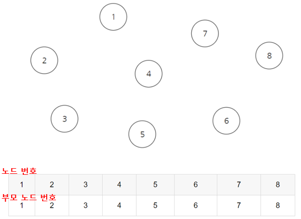

## 다중 조건 정렬
아래는 학번, 이름, 주소순으로 정렬하는 예제
```java
class Student {
    int num;
    String name;
    String address;
    
    Student(int num, String name, String address) {
        this.num = num;
        this.name = name;
        this.address = address;
    }
}


class StudentCompare implements Comparator<Student> {
    int ret = 0;
    
    @Override
    public int compare(Student s1, Student s2) {
        if(s1.num < s2.num) {
            ret = -1;
        }
        if(s1.num == s2.num) {
            if(s1.name.compareTo(s2.name) == 0) {
                if(s1.address.compareTo(s2.address) < 0) {
                    ret = 1;
                } else if(s1.address.compareTo(s2.address) == 0) {
                    ret = 0;
                } else if(s1.address.compareTo(s2.address) > 0) {
                    ret = -1;
                }
            } else if(s1.name.compareTo(s2.name) < 0) {
                ret = -1;
            } else if(s1.name.compareTo(s2.name) > 0) {
                ret = 1;
            }
        }
        if(s1.num > s2.num) {
            ret = 1;
        }
        return ret;
    }
}
```

## Comparator 람다 활용
- 기본 표현 방식
```java
Collections.sort(books, new Comparator<Book>() {
   @Override
   public int compare(Book o1, Book o2) {
       return o2.getPrice()-o1.getPrice();
  }
});
```

- 람다
```java
Collections.sort(books, (o1, o2) -> o2.getPrice()-o1.getPrice()); 
```

## Two pointer
투 포인터는 좌측 포인터(작은 값), 우측 포인터(큰 값) 각각을 두고 범위를 좁혀가는 알고리즘이다.

## BFS
```java
void BFS(int start, int[][] graph, int[] path){
    Queue<Integer> queue = new LinkedList();
    queue.add(start);
    path[start]=0;
    while(!queue.isEmpty()){
        int curr = queue.poll();
        for(int i=0; i<graph[curr].length; i++){
            if(graph[curr][i]==1 && path[i]==-1){
                queue.add(i);
                path[i]=path[curr]+1;
            }
        }
    }
}
```

## DFS
```java
//재귀
void DFS(int start, int[][] graph, boolean[] visited){
    visited[start]=true;
    for(int i=0; i<graph[start].length; i++){
        if(graph[start][i]==1 && !visited[i])
            DFS(i,graph,visited);
    }
}

//스택
void DFS(int start, int[][] graph; boolean[] visited){
    Stack<Integer> stack = new Stack();
    stack.push(start);
    visited[start]=true;
    while(!stack.empty()){
        int curr = stack.pop();
        for(int i=0; i<graph[curr].length; i++){
            if(graph[curr][i]==1 && !visited[i]){
                stack.push(i);
                visited[i]=true;
            }
        }
    }
}
```

## DP(Dynamic Programming)
이전 결과가 이후 결과에 사용됨(메모이제이션, 테뷸레이션) + 점화식
- 최적 부분 구조
- 중복되는 부분 문제

#### 메모이제이션(Memoization)
재귀함수로 구현되며 Top-down(하향식)으로 구현하며 필요한 계산만 하게 된다.

#### 테뷸레이션(Tabulation)
반복문으로 구현되며 Bottom-up(상향식)으로 구현되며 모든 계산을 하게 됨.

## Greedy
매 순간 최적의 수를 고려
- 최적 부분 구조(문제의 최종 해결법이 부분 문제에서도 해결법임)
- 탐욕적 선택 속성(앞의 선택이 이후의 선택에 영향을 끼치지 않음)

ex. 화폐 단위가 1/5/10이고 106원이 존재할 때, 가장 적은 수의 화폐를 발행하시오
-> 첫번째로는 10으로 나눔(가장 최적)
-> 두번째로는 5로 ...


## 트라이(Trie)
문자열 검색 및 처리를 위한 알고리즘. 하나의 문자를 노드로 생각하여 트리 구조에 저장하게 된다.
 - 장점. 문자열 검색에 O(n)의 시간 필요
 - 기존 방식. 문자열을 String으로 저장하여 m개의 문자열 중 길이 n의 문자열을 찾는 경우 O(mn)이 소요됨


```kotlin
class Trie{
    data class Node(
        var word:String?=null,
        val children:MutableMap<Char,Node> = mutableMapOf()
    )

    private val root = Node()

    fun insert(word:String){
        var currentNode=root
        for(char in word){
            if(currentNode.children[char]==null)
                currentNode.children[char] = Node()
            currentNode = currentNode.children[char]!! //삽입한 노드로 이동(or 이미 존재하는 노드로 이동)
        }
        currentNode.word = word
    }

    fun search(word:String) : Boolean{
        var currentNode=root
        for(char in word){
            if(currentNode.children[char]==null)
                return false
            currentNode=currentNode.children[char]!!
        }
        return currentNode.word != null
    }

}
```


## 다익스트라 알고리즘
가중치가 있는 방향 그래프에서 한 정점에서 나머지 정점까지의 최단 거리를 구하고자 할 때 사용한다.
```cpp
void shortedPath(int v){
        for(int i=0; i<n; i++){
            dist[i]=length[v][i];
            path[i]=v;
            s[i]=false;
        }
        s[v]=true;
        for(int i=0; i<n-2; i++){
            int u=choose(n); s[u]=true; //방문하지 않은 거리가 최소인 점
            for(int w=0; w<n; j++){
                if(!s[w]){
                    if(dist[w]>(dist[u]+length[u][w])){
                        dist[w]=dist[u]+length[u][w];
                        path[w]=u; //최단 비용으로 가는 경로를 탐색하기 위함.
                    }
                }
            }
        }
    }
```

## 크루스칼 알고리즘(Kruskal Algorithm)
최소 신장 트리(MST; Minimum Spanning Tree)를 구하는데 사용되는 알고리즘. 노드가 N개로 이루어질 경우,
전체 노드 N개를 N-1개의 간선으로 이동하는데 가중치를 최소로 해야한다. (사이클은 존재하지 않아야 함)

##### 구현 방법
 1. 간선을 오름차순 정렬
 2. 사이클이 생성되지 않는 가중치가 가장 작은 간선부터 선택
 3. N-1개의 간선이 선택될 때까지 반복


## 트리의 지름 구하기
양방향 그래프(트리)이며 모든 정저미 서로 연결되어 있는 경우,
가장 먼 두 정점 사이의 거리 혹은 가장 먼 두 정점을 연결하는 경로를 트리의 지름이라고 한다.
DFS를 두번 사용하여 O(n)에 해결 가능하다.

##### 구현 방법
 1. 한 점 x(보통 루트)에서 가장 거리가 먼 점 t를 찾는다. => DFS로 t를 찾기
 2. t에서 가장 거리가 먼 점 u를 찾는다. => t에서 DFS 수행하기
 3. t-u가 트리의 지름이다.


## 유니온 파인드 (Union-Find)
대표적인 그래프 알고리즘으로 **합집합 찾기** 혹은 **서로소 집합**이라는 의미를 가진다. 여러 노드가 존재할 때, 두 개의 노드를 선택하여 두 노드가 서로 같은 그래프에 속하는지 판별할 때 사용한다.

#####구현 방법
 1. parent 배열을 모두 자기 자신의 노드 인덱스로 초기화
 2. 연결되어 있는 경우 부모의 인덱스 값으로 초기화




##### Find
x가 속해있는 그래프의 root를 반환
```kotlin
fun find(x:Int): Int{
    if(x == parent[x])
        return x
    else{
        int p = find(parent[x])
        parent[x]=p
        return p
    }
}
```

##### Union
x에 y를 붙이는 함수(y의 root를 x로 지정)
```kotlin
fun union(x:Int, y:Int){
    x = find(x)
    y = find(y)

    if(x!=y)
        parent[y]=x
}
```


## 위상 정렬


