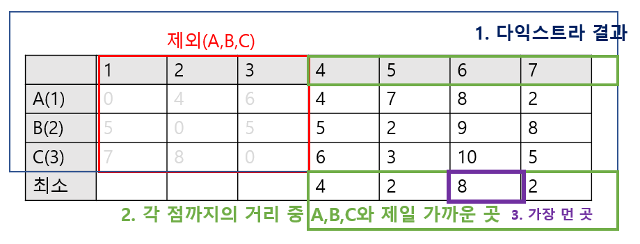

# 가장 먼 곳
[문제](https://www.acmicpc.net/problem/22865)

### 문제 설명
- N개의 노드가 존재한다. (1~N번) 
- 그 중 3개의 점 A,B,C까지의 거리가 가장 먼 노드를 찾아서 출력하라.
- 예를 들어, X라는 점이 A,B,C=(2,3,4) 거리가 소요되고, Y라는 점은 A,B,C=(4,7,6)이라면 Y가 멀다.(최소가 4이기 때문이다.)
- 만약 거리가 같다면 더 작은 번호인 노드를 반환하라.


### Note
- 다익스트라를 이용해 구현
- A,B,C를 제외한 나머지 점들로 부터 다익스트라를 시작하면 시간초과가 발생
- 역으로 생각하여, (A,B,C)에서 다익스트라를 시작하여 가장 먼 점을 찾아 다익스트라를 N회가 아닌 3회만 돌게 하여 시간 단축
- 획득한 결과에 대해 (A,B,C)에서 4,5,6,7 점까지의 거리(가장 가까운 곳) 중 가장 먼 곳을 선택




### 코드
```java
public class Main {
    public static class Edge implements Comparable<Edge>{
        int dest;
        int length;
        public Edge(int d,int l){
            dest = d;
            length = l;
        } 
        @Override
        public int compareTo(Edge o){
            return this.length - o.length;
        }
    }


    public static void main(String[] args) {
        try {
            BufferedReader br = new BufferedReader(new InputStreamReader(System.in));
            int N = Integer.parseInt(br.readLine());
            int points[] = Arrays.stream(br.readLine().split(" ")).mapToInt(Integer::parseInt).toArray();
            int edgeCount = Integer.parseInt(br.readLine());

            List<List<Edge>> graph = new ArrayList();
            for (int i = 0; i < N + 1; i++)
                graph.add(new ArrayList());


            for (int i = 0; i <edgeCount; i++) {
                String[] x = br.readLine().split(" ");
                int node1 = Integer.parseInt(x[0]);
                int node2 = Integer.parseInt(x[1]);
                int length = Integer.parseInt(x[2]);

                graph.get(node1).add(new Edge(node2,length));
                graph.get(node2).add(new Edge(node1,length));
            }


            // === 알고리즘 시작 ==== //

            int maxNode = Integer.MAX_VALUE;            
            int maxDist = Integer.MIN_VALUE;
            int[] dist1 = dijkstraPQ(graph, points[0], N);
            int[] dist2 = dijkstraPQ(graph, points[1], N);
            int[] dist3 = dijkstraPQ(graph, points[2], N);


            int[] results = new int[N+1];
            
            //친구들 집에서 가장 가까운 집까지의 거리 저장
            for(int i=1; i<N+1; i++){
                int min = Math.min(Math.min(dist1[i],dist2[i]),dist3[i]);
                results[i]=min;      
            }

            //위에서 저장한 값 중 가장 먼 곳
            int max = -1;
            int node = N+2;
            for(int i=1; i<N+1; i++){
                if(isHome(points,i))
                    continue;
                if(results[i] > max){
                    max = results[i];
                    node = i;
                }else if(results[i]==max && node > i){
                    node = i;
                }
            }
            System.out.println(node);

        } catch (Exception e) {
            e.printStackTrace();
        }
    }


    // === 다익스트라 알고리즘 ==== //
    public static int[] dijkstraPQ(List<List<Edge>> graph, int start, int N){
        PriorityQueue<Edge> pq = new PriorityQueue<>();
        boolean[] visited = new boolean[N + 1];

        int[] dist = new int[N + 1];
        Arrays.fill(dist,Integer.MAX_VALUE);

        pq.add(new Edge(start,0));
        dist[start] = 0;


        while(!pq.isEmpty()){
            Edge curr = pq.poll();

            if(visited[curr.dest])
                continue;
            visited[curr.dest] = true;

            for(Edge next : graph.get(curr.dest)){
                int length_ = curr.length + next.length;
                if(length_ < dist[next.dest]){
                    dist[next.dest] = length_;
                    pq.add(new Edge(next.dest,length_));
                }
            }
        }

        return dist;
    }


    public static boolean isHome(int[] points, int target){
        return points[0] == target || points[1] == target || points[2] == target;
    }

}
```


