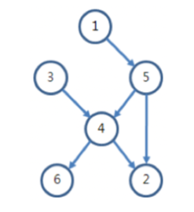

# 키 순서
[문제](https://www.acmicpc.net/problem/2458)

### 문제 설명
- N명의 학생이 주어지고 두 학생간 키를 비교한 일부 결과 E개가 주어진다.
- 이를 통해 키의 순서를 유추할 수 있는 학생의 수를 구하라.


### Note
- 이런 한 그룹 내에서 두 요소 간 대소 관계를 제시하는 경우 그래프 문제로 표현 가능
- 프로그래머스 '순위' 문제와 동일함 (해당 문제는 DFS를 양 방향에서 수행하여 해결)
- X에서 Y로 갈 수 있는 수 + Y에서 X로 갈 수 있는 수가 N-1인 경우 순서를 유추할 수 있는 요소이다.



```python
import sys

V,E = map(int,sys.stdin.readline().split())
## 그래프 초기화
INF = int(1e9)
graph = [[INF] * (V+1) for _ in range(V+1)]

## 간선 입력
for _ in range(E):
    start,end = map(int,sys.stdin.readline().split())
    graph[start][end]= 1


for k in range(1,V+1):
    for i in range(1,V+1):
        for j in range(1,V+1):
            graph[i][j] = min(graph[i][k]+graph[k][j], graph[i][j])


count = 0

for i in range(1,V+1):
    sum = 0
    for j in range(1,V+1):
        if graph[i][j] != INF:
            sum=sum+1
        if graph[j][i] != INF:
            sum=sum+1
    if sum == V-1:
        count = count+1
        
print(count)
```