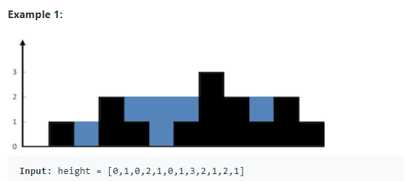

# Trapping Rain Water

[문제](https://leetcode.com/problems/trapping-rain-water/)

## 문제 설명
빗물을 가둘 수 있는 벽의 높이가 정의된 배열을 주고 해당 벽 사이의 빗물의 총 양을 계산하는 문제



## 아이디어
- 벽을 여러 구간으로 나누고 나눈 구간 별로 합하는 분할 정복 기법을 활용


## 코드
```java
class Solution {
    int total = 0;
    public int trap(int[] height) {
        recurse(height, 0, height.length-1);
        return total;
    }
    
    void recurse(int[] height, int left, int right){
        if(left<right){
            //가장 높은 중간 벽
            int maxIndex = findMaxIndex(height,left,right);

            //중간 벽의 좌측 구간에서 가장 높은 벽
            int leftTopIndex = findMaxIndex(height, left, maxIndex-1);
            if(leftTopIndex!=-1){
                int result=sum(height, leftTopIndex, maxIndex);
                total+=result;
                recurse(height, left, leftTopIndex); //더 좌측 구간에 대해 재귀
            }

            //중간 벽의 우측 구간에서 가장 높은 벽
            int rightTopIndex = findMaxIndex(height, maxIndex+1,right);
            if(rightTopIndex!=-1){
                int result=sum(height, maxIndex, rightTopIndex);
                total+=result;
                recurse(height, rightTopIndex ,right); //더 우측 구간에 대해 재귀
            }
        }
    }

    //두 벽 (left, right) 사이의 빗물 양 계산
    int sum(int[] height, int left, int right){
        if(left<0 || right >=height.length)
            return 0;
        int min = Math.min(height[left],height[right]);
        int sum = 0;
        
        for(int i=left+1; i<right; i++){
            sum+=min-height[i];
        }
        return sum;
    }
    
    //left~right 사이 구간에서 가장 높은 벽의 인덱스 반환
    int findMaxIndex(int[] height, int left, int right){
        if(left>right || right >=height.length || left<0){
            return -1;
        }
        int max = Integer.MIN_VALUE;
        int index = left;
        for(int i=left; i<=right; i++){
            if(max < height[i]){
                max=height[i];
                index = i;
            }
        }
        return index;
    }
}
```


